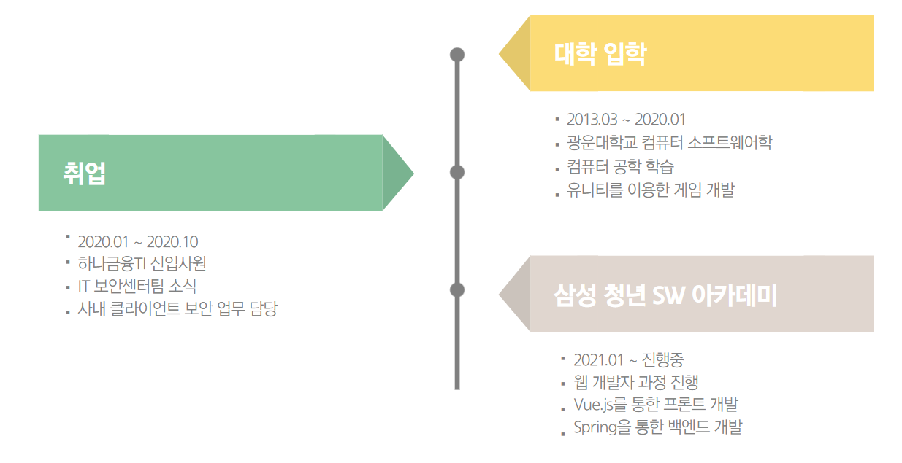

# Resume

## 정준영 **(Jung junyoung)**

### 🗓️  1993.09.18

### 👨‍🎓 광운대학교 컴퓨터 소프트웨어학

### 📞  010-2601-4683

### 📧  cua0918@naver.com

### 💻  [https://9327144.tistory.com/](https://9327144.tistory.com/)

### GitHub :  [https://9327144.tistory.com/](https://9327144.tistory.com/)

### Portfolio : [https://github.com/jjy0918/Resume/blob/master/Portfolio.pdf](https://github.com/jjy0918/Resume/blob/master/Portfolio.pdf)

# 🗣️ INTRODUCE

다양한 경험과 진로 고민을 거쳐, **백엔드 개발자**의 길을 걷고있는 학생입니다.

새로운 기술 습득을 좋아하고 관심이 많습니다.

웹에 관심이 생겨 기존에 다니던 직장을 그만두고, 삼성 청년 SW 아카데미에서 웹 과정을 진행하고 있습니다.

현재에 안주하지 않고 끊임 없이 생각하고, 고민하는 개발자로 성장하기 위해 노력하고 있습니다. 

# ⚙ SKILLS

### FrontEnd

- **HTML/CSS**
- **Javascript**
- **Vue.js**

---

### Backend

- **Java**
- **Spring (boot)**

---

### DB

- **MySQL**
- **MyBatis**

---

### Etc

- **C#**
- **Unity**
- **Python**

# 💻 PROJECTS

## 유튜브 뮤직 플레이어

- 📅 2018.01 ~ 2018.04
- **유튜브 뮤직의 단점을 개선한 윈도우 프로그램 개발**
- **Skills**

    `C#` `.NetFramework` `WindowsForm` 

- **담당 역할**

    유튜브 API를 이용한 음원 재생 및 윈도우 프로그램 개발

- **개발 내용**
    1. 기존의 음원 사이트에서 음원 정보를 가져와 저장.
    2. 유튜브 API를 이용하여 음원 재생 및 저장
    3. Windows Form을 이용하여 GUI 프로그램 개발
    4. 자신만의 플레이 리스트 저장 및 음원 관리, 검색 기능 개발

## Rythm Dodger

- 📅 2018.03 ~ 2018.06
- **리듬을 기반으로 등장하는 장애물을 피하는 게임**
- **Skills**

    `C#` `Unity` 

- **담당 역할**

    장애물, 아이템, 화면 구현

- **개발 내용**
    1. 장애물 등장 및 장애물 충돌 처리 구현
    2. 각종 아이템 구현.
    3. 아이템 사용 시 화면 처리 구현.

## 초소형 컴퓨터를 활용한 지능형 교통신호기

- 📅 2018.11 ~ 2019.11
- **라즈베리파이를 이용하여 차량을 인식과 지능형 교통 신호기 구현**
- **Skills**

    `C#` `Unity` 

- **담당 역할**

    실제 차량의 움직임을 디스플레이로 구현하여, 지능형 교통 신호기의 효용성 표현

- **개발 내용**
    1. 경기도 교통 DB 센터에서 제공하는 자료 분석 하여 실제 차량의 움직임 구현
    2. 일반 신호와 지능형 교통 신호기 비교 후 시각화

## 탐방

- 📅 2021.05 ~ 2021.06
- **다양한 테마를 바탕으로 주거지 선택을 도와주는 웹 사이트**
- **Skills**

    `JAVA` `Spring` `MySQL` `Vue.js` 

- **담당 역할**

    백엔드 개발, REST API 구축 및 프론트엔드 보조

- **개발 내용**
    1. 테마별 필요한 데이터 분석 및 공공 API를 통해 테마에 맞는 데이터 가공 및 DB에 저장
    2. 클라이언트에서 요청 시 해당 데이터를 알맞게 제공

## RealTime Project

- 📅 2021.05 ~ 진행중
- **실시간으로 다양한 카테고리의 트렌드를 수집하고, 실시간 SNS 반응을 추출하여 시각화**
- **Skills**

    `JAVA` `Spring` `MySQL` `Vue.js` 

- **담당 역할**

    백엔드 개발, REST API 구축

- **개발 내용**
    1. 1시간마다 해당 카테고리에 맞는 뉴스를 각종 포탈에서 수집
    2. 뉴스의 키워드를 추출하여 수집 및 분류.
    3. 현재 트렌드에 맞는 키워드 추출 및 가공.
    4. 추출한 키워드에 대한 SNS 반응 추출 및 가공.
    5. 클라이언트에서 요청 시 해당 데이터를 REST API 형태로 통신 및 시각화

# 🎖 AWARDS

### 2019.11

**졸업작품 전시회 (우수상)**

광운대학교 컴퓨터 소프트웨어학과 졸업 작품 전시회

### 2021.05

**삼성 청년 SW 아카데미 성적 우수자 (1등)**

삼성전자 주관 삼성 청년 SW 아카데미 1학기 성적 우수자

### 2021.05

**삼성 청년 SW 아카데미 프로젝트 최우수자 (최우수상)**

삼성전자 주관 삼성 청년 SW 아카데미 1학기 프로젝트 우수자

# 🏫 EDUCATION

### 2009.03 ~ 2012.02

**중산고등학교 졸업**

서울특별시

### 2013.03 ~ 2020.02

**광운대학교 졸업**

컴퓨터 소프트웨어학 전공

### 2021.01 ~ 진행중

**삼성 청년 SW 아카데미**

웹 개발 과정

# 💼EXPERIENCE

### 2020.01 ~ 2020.10

**하나금융티아이**

IT보안센터팀 - 사내 클라이언트 보안
